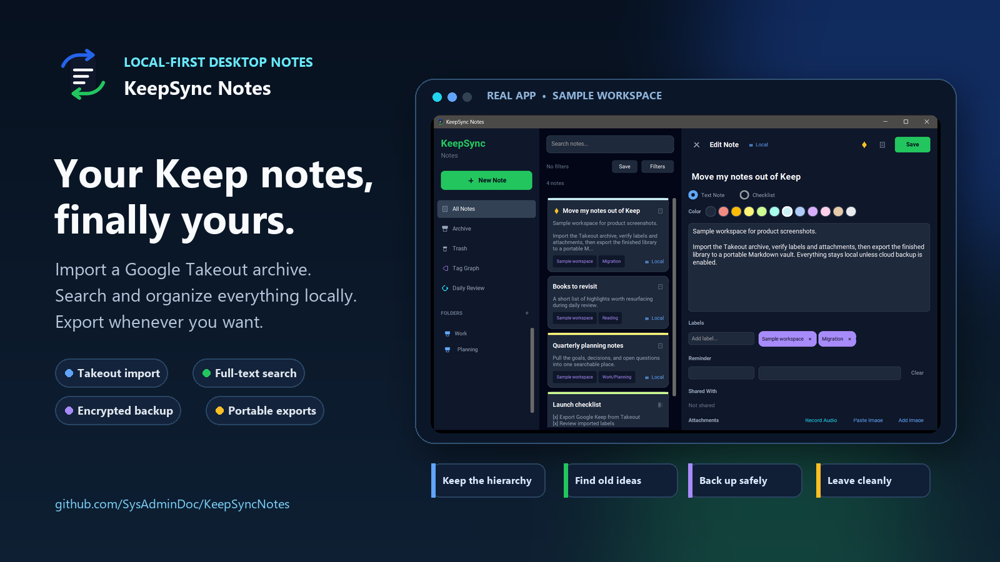
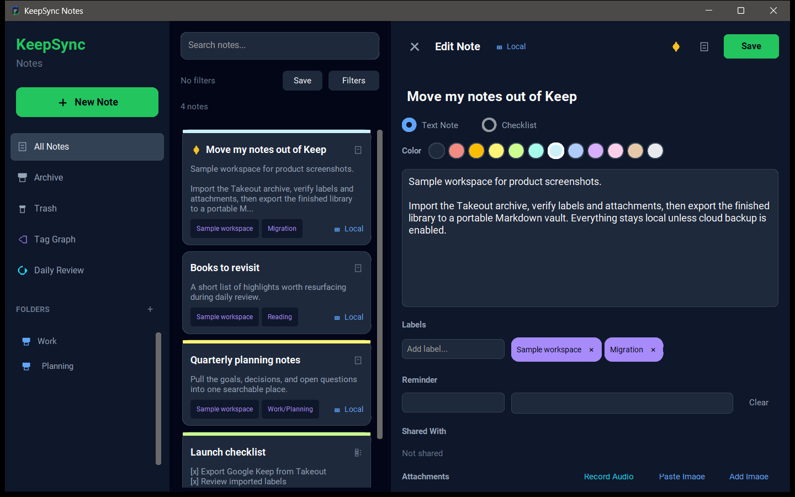
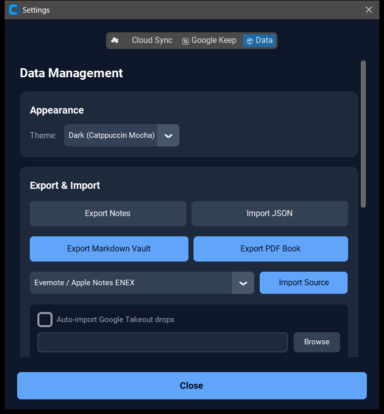

# KeepSync Notes

[](https://github.com/SysAdminDoc/KeepSyncNotes/releases/latest)
[](LICENSE)


KeepSync Notes turns exported notes into a fast local library you can search, edit, back up, and move somewhere else. Google Takeout is the easiest way in. It also understands several common note formats, including ENEX and Obsidian vaults.

Your library lives in a local SQLite database. Nothing uploads unless you choose and configure a cloud backup provider.

## See the real app



The three-panel workspace keeps folders, search results, and the active editor visible together. This capture comes from the real Windows app with sample notes made for the screenshot.



Imports, portable exports, encrypted backups, and appearance settings stay in one place.

## Why people use it

- Leave Google Keep without flattening everything into a pile of text files. Takeout imports preserve labels, checklists, colors, pins, reminders, attachments, and archive state.
- Find old material quickly with SQLite full-text search, saved searches, folders, filters, and an optional local semantic index.
- Keep a clean exit route. Export a Markdown vault or PDF book whenever you need one.
- Back up locally with versioned snapshots or password-protected AES-256-GCM archives. Google Drive and private GitHub backup are optional.

## Supported workflows

| Bring notes in | Work locally | Take notes out |
| --- | --- | --- |
| Google Keep Takeout ZIP or folder | Text notes and nested checklists | Markdown vault with attachments |
| Evernote or Apple Notes ENEX | Labels, folders, colors, pins, and reminders | PDF book |
| Standard Notes, Bear, or Simplenote exports | Attachments, image OCR, and voice notes | JSON export |
| Obsidian vaults, OneNote HTML, or Windows clipboard history | Ranked search, daily review, and tag relationships | Encrypted backup |

Re-imports are delta aware, so unchanged notes are skipped. When two versions differ, KeepSync Notes can show the conflict and let you keep either copy or merge them.

## Install on Windows

Download the current Windows package from [Releases](https://github.com/SysAdminDoc/KeepSyncNotes/releases/latest), extract it, and run `KeepSyncNotes.exe`. The app carries its Python runtime and doesn't install packages when it starts.

## Run from source

Python 3.10 or newer is required.

```powershell
git clone https://github.com/SysAdminDoc/KeepSyncNotes.git
cd KeepSyncNotes
python -m venv .venv
.\.venv\Scripts\python -m pip install -r requirements.txt
.\.venv\Scripts\python keepsync_notes.py
```

On macOS or Linux, replace the last two commands with `.venv/bin/python`.

## Import Google Keep

1. Open [Google Takeout](https://takeout.google.com) and select Keep.
2. Download the export as a ZIP file.
3. Open **Settings**, choose **Data**, then select the Takeout ZIP or extracted Keep folder.
4. Review the import report before working with the new library.

You can also point the auto-import watcher at a folder where new Takeout downloads arrive.

## Privacy and storage

- Notes and attachments stay under the platform application data directory.
- Keep, Google Drive, and GitHub credentials go into the operating system keyring.
- Cloud backup is off until you configure it.
- Permanent deletion creates a local safety backup first.

## Optional tools

Image OCR uses a local Tesseract installation. Semantic search needs `fastembed` and `lancedb`, which are intentionally optional. Voice transcription runs through faster-whisper and may download the selected speech model the first time you use it.

## Test and package

```powershell
.\.venv\Scripts\python -m unittest discover -s tests -v
.\packaging\build_release.ps1
```

The release builder creates a windowed one-file executable, a ZIP package, and SHA-256 checksums in `dist`.

## Support development

If KeepSync Notes earns a spot in your workflow, a coffee helps fund maintenance and future releases.

<a href="https://ko-fi.com/X8K126YVER">
  
</a>

## License

[MIT](LICENSE)
